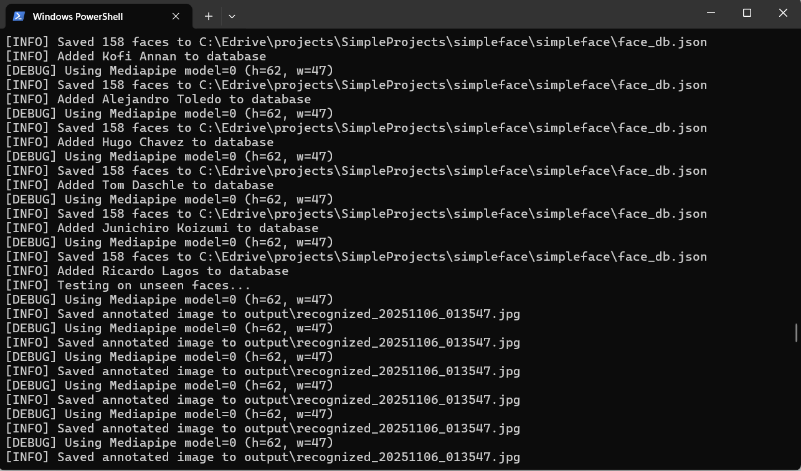
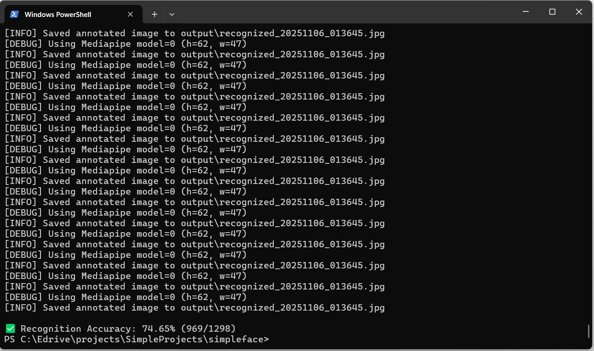

# facial_recognition
**facial_recognition** aims to be the most effective face recognition [library](https://pypi.org/project/facial-recognition/) for python that you can install with a single command


```
pip install facial_recognition
```
After that, you need to download and setup the model file used for recognition by running the following command (Even if you dont do this now, the model file will be downloaded the first time you run this library)

```
facial_recognition-setup
```
In case this results in an error, you need to manually download the model file to the path where facial_recognition is installed( Usually on Windows its in C:\Users\user\AppData\Local\Programs\Python\Python312\Lib\site-packages\facial_recognition) using wget on Linux and Invoke-WebRequest on Windows

```
Invoke-WebRequest https://huggingface.co/Rubarion/facial_recognition_model/resolve/main/arcface.onnx -OutFile arcface.onnx
```
(The model file is a single file of around 130Mb in size. Currently this has to be downloaded serparately as pypi has a limit of 100Mb for the total pacakage size. If and when pypi allows me to bundle the model file along with the code, you only need to run `pip install facial_recognition`)

**Works the same on all Operating systems be it Windows,Linux or Mac and also installs the same on all**


**Adding Known faces to the database**
Just copy a preferably high definition camera facing and face clearly visible single photo of each person you want recognized to a folder and rename it with the name of that person. Afte you have copied and renamed all known faces in this manner, Run the following command from inside the folder (open the folder and then right click shell/terminal)


```
facial_recognition add_faces
```


This creates a database of known faces to which the faces in the new image that you give will be compared for matching. As the accuracy of this library is solely dependednt on the quality of the single photo of each person that you store in databse, please make sure that you use a very clear photo where the face is looking straight at the camera and slightly zoomed in so that the entire face region is clearly visible.


**Recognizing Images**
Then inorder to recognise the faces in a image, lets say sample.jpg, Open terminal in the folder where this image is stored and simply run


```
facial_recognition recognize sample.jpg
```

This will create an output folder in that same folder and the corresponding output image with boxes drawn around faces and labels will be saved in that folder.


To remove all stored known faces and start again

```
facial_recognition remove_faces
```


# Demo -Below you can see facial_recognition correctly recognizing actors Tom Cruise and Leonardo DiCaprio amongst a group of other people from just a single photo of them


*Images stored as known faces*


*Output image with all the faces identified and labelled correctly*


# How to Use in Programs

To prepare the database of known faces to which the detected faces in the input image will be compared, so as to get a match, there are two methods, the second of which is the most easiest of any face recognition package. You can either add faces manually as in the code below.


```python
from facial_recognition import add_person

#Adding images of Tom Crusie and Leonardo Dicaprio using add_person function
add_person("Tom","tom.jpg")
add_person("Leonardo","leonardo.png")
```

*Accepts both jpg as well as png images*

Or in the most easiest way, you can use the add_faces_from_folder function to add all faces in a folder with the names of image files being the names of the people you want recognised. For eg if image file name is leonardo1.png, then the person's name will be taken as leonardo1 and that itself will be marked in the output image. If you are running the script from the same folder as the images, then there is no need to give any arguments to the function.


```python
from facial_recognition import add_faces_from_folder
add_faces_from_folder()
```


Or if your script/program is in any other folder, then just give the path to the folder containing your known persons images as the argument to the function, but make sure to **add r before the quoatation mark** to avoid a common python path error


```python
from facial_recognition import add_faces_from_folder
add_faces_from_folder(r"Your path to image folder")
```

After that, again it is insanely easy to recognize the faces in any image (both jpg and png) and generate the output image with all the known and unknown faces labelled.


```python

from facial_recognition import recognize_image

recognize_image("test.png")
```

Finally to remove all known faces stored in the database and start fresh

```python
from facial_recognition import remove_face_database
remove_face_database()
```

**Recognizing faces in Videos**
Also very easy to do by taking each frame from any video file or video feed and passing it to the recognize_image function

```python
from facial_recognition import recognize_image

for frame in video_feed:
    recognize_image(frame)

# Testing and Accuracy

This package was tested on the **[Labelled Faces in the Wild (LFW Dataset)](https://www.kaggle.com/datasets/jessicali9530/lfw-dataset?utm_source=chatgpt.com) and a very impressive 74.65% accuracy or 969 faces recognised correctly out of total 1298 was obtained.** (Screenshots of test running in terminal attached below)





Why accuarcy is not close to 100% is because the images in this dataset are very small cropped faces as shown in the output images below (where the facial_recognition package correctly recognised Angelina Jolie and Catherine Zeta Jones) and as we are very unlikely to encounter such small cropped close up shots of face images or frames in the real world, it was not worth the effort to tweak the code to obtain >90% accuracy just for this dataset. Basically this test proves that both fo normal images of persons as well as for very small images like this, the package does very very well in correctly identifying the faces.


**Please note in case of any bugs that this library will be updated frequently**
